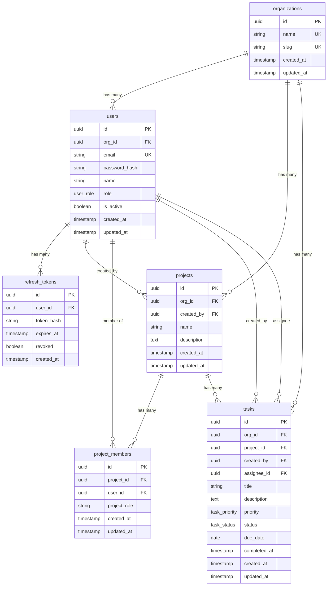

# Database Schema — Team Task Tracker

## Entity Relationship Diagram

---

## Table Descriptions

### `organizations`
Root tenant table. All other tables are scoped under an organization.

| Column | Type | Constraints |
|--------|------|-------------|
| `id` | UUID | PK, default `gen_random_uuid()` |
| `name` | VARCHAR(255) | NOT NULL, UNIQUE |
| `slug` | VARCHAR(255) | NOT NULL, UNIQUE |
| `created_at` | TIMESTAMP | NOT NULL, default NOW() |
| `updated_at` | TIMESTAMP | NOT NULL, auto-updated via trigger |

---

### `users`
Organization members. Role is enforced as an ENUM type.

| Column | Type | Constraints |
|--------|------|-------------|
| `id` | UUID | PK |
| `org_id` | UUID | FK → organizations.id, CASCADE DELETE |
| `email` | VARCHAR(255) | NOT NULL, UNIQUE |
| `password_hash` | VARCHAR(255) | NOT NULL |
| `name` | VARCHAR(255) | NOT NULL |
| `role` | `user_role` ENUM | NOT NULL, default `MEMBER` |
| `is_active` | BOOLEAN | NOT NULL, default `true` |
| `created_at` | TIMESTAMP | NOT NULL |
| `updated_at` | TIMESTAMP | NOT NULL, auto-updated |

**ENUM:** `user_role` → `ADMIN`, `MANAGER`, `MEMBER`

**Indexes:** `idx_users_org_id`, `idx_users_org_role (org_id, role)`

---

### `refresh_tokens`
Stores hashed JWT refresh tokens for secure rotation. Old tokens are revoked on use.

| Column | Type | Constraints |
|--------|------|-------------|
| `id` | UUID | PK |
| `user_id` | UUID | FK → users.id, CASCADE DELETE |
| `token_hash` | VARCHAR(255) | NOT NULL |
| `expires_at` | TIMESTAMP | NOT NULL |
| `revoked` | BOOLEAN | NOT NULL, default `false` |
| `created_at` | TIMESTAMP | NOT NULL, default NOW() |

**Indexes:** `idx_refresh_tokens_user_id`, `idx_refresh_tokens_hash`

---

### `projects`
Projects belong to an organization and are created by a user.

| Column | Type | Constraints |
|--------|------|-------------|
| `id` | UUID | PK |
| `org_id` | UUID | FK → organizations.id, CASCADE DELETE |
| `created_by` | UUID | FK → users.id, RESTRICT DELETE |
| `name` | VARCHAR(255) | NOT NULL |
| `description` | TEXT | nullable |
| `created_at` | TIMESTAMP | NOT NULL |
| `updated_at` | TIMESTAMP | NOT NULL, auto-updated |

**Indexes:** `idx_projects_org_id`

---

### `project_members`
Join table for users ↔ projects with a per-project role. A user can be `OWNER` or `MEMBER` on a project.

| Column | Type | Constraints |
|--------|------|-------------|
| `id` | UUID | PK |
| `project_id` | UUID | FK → projects.id, CASCADE DELETE |
| `user_id` | UUID | FK → users.id, CASCADE DELETE |
| `project_role` | VARCHAR(20) | NOT NULL, default `MEMBER` |
| `created_at` | TIMESTAMP | NOT NULL |
| `updated_at` | TIMESTAMP | NOT NULL, auto-updated |

**Unique Constraint:** `(project_id, user_id)` — a user can only be a member once per project.

**Indexes:** `idx_project_members_project_id`, `idx_project_members_user_id`

---

### `tasks`
Core work items. Belong to an org, project, creator, and optional assignee.

| Column | Type | Constraints |
|--------|------|-------------|
| `id` | UUID | PK |
| `org_id` | UUID | FK → organizations.id, CASCADE DELETE |
| `project_id` | UUID | FK → projects.id, CASCADE DELETE |
| `created_by` | UUID | FK → users.id, RESTRICT DELETE |
| `assignee_id` | UUID | FK → users.id, SET NULL on DELETE, nullable |
| `title` | VARCHAR(500) | NOT NULL |
| `description` | TEXT | nullable |
| `priority` | `task_priority` ENUM | NOT NULL, default `MEDIUM` |
| `status` | `task_status` ENUM | NOT NULL, default `TODO` |
| `due_date` | DATE | nullable |
| `completed_at` | TIMESTAMP | nullable, set when status = DONE |
| `created_at` | TIMESTAMP | NOT NULL |
| `updated_at` | TIMESTAMP | NOT NULL, auto-updated |

**ENUMs:**
- `task_priority` → `LOW`, `MEDIUM`, `HIGH`
- `task_status` → `TODO`, `IN_PROGRESS`, `IN_REVIEW`, `DONE`, `BLOCKED`

**Indexes:** `idx_tasks_status`, `idx_tasks_assignee_id`, `idx_tasks_due_date`, `idx_tasks_org_status`, `idx_tasks_project_id`, `idx_tasks_org_assignee`

---

## Summary

| Table | Rows Scope | Key FKs |
|-------|-----------|---------|
| `organizations` | Root | — |
| `users` | per-org | → organizations |
| `refresh_tokens` | per-user | → users |
| `projects` | per-org | → organizations, users |
| `project_members` | per-project | → projects, users |
| `tasks` | per-org/project | → organizations, projects, users (×2) |
